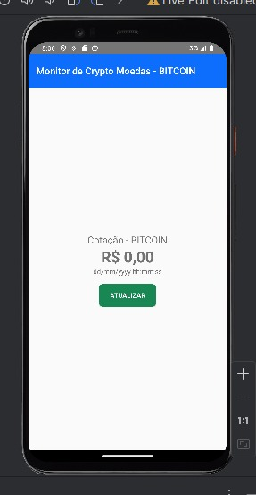
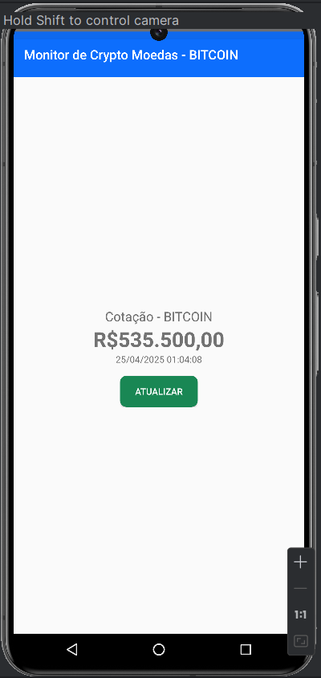

# Monitor de Cotação BTC

**Autor:** dimilopes

## Descrição Geral

Esta aplicação Android tem como objetivo monitorizar e exibir a cotação atual do Bitcoin (BTC) em Reais (BRL). Os dados da cotação são obtidos através da API pública do Mercado Bitcoin.

As principais funcionalidades incluem:
*   Exibição do último preço de negociação do Bitcoin.
*   Exibição da data e hora da última cotação obtida.
*   Um botão para atualizar manualmente os dados da cotação.

## Tecnologias Utilizadas

*   **Linguagem de Programação:** Kotlin
*   **Plataforma:** Android
*   **Componentes Android Jetpack:** AppCompat para compatibilidade.
*   **Concorrência:** Kotlin Coroutines para chamadas de rede assíncronas.
*   **Networking:** (Provavelmente Retrofit e OkHttp, inferido pela estrutura de `MercadoBitcoinServiceFactory.kt` e `MercadoBitcoinService.kt`).
*   **API Externa:** `https://www.mercadobitcoin.com.br/api/BTC/ticker`

## Como Executar o Projeto

1.  Clone este repositório ou descompacte os ficheiros do projeto.
2.  Abra o projeto no Android Studio.
3.  Aguarde o Gradle sincronizar e construir o projeto.
4.  Execute a aplicação num emulador Android ou num dispositivo físico.

## Estrutura do Projeto

O projeto segue a estrutura padrão de uma aplicação Android:

*   `app/src/main/java/carreiras/com/github/cryptomonitor/`: Contém o código-fonte Kotlin.
    *   `MainActivity.kt`: A atividade principal da aplicação, responsável pela lógica da interface do utilizador e pelas chamadas de serviço.
    *   `model/`: Contém os modelos de dados (ex: `TicketResponse.kt` para mapear a resposta da API).
    *   `service/`: Contém a lógica para interagir com a API do Mercado Bitcoin (ex: `MercadoBitcoinService.kt` e `MercadoBitcoinServiceFactory.kt`).
    *   `ui/theme/`: Contém as definições de tema da aplicação.
*   `app/src/main/res/`: Contém todos os recursos da aplicação.
    *   `layout/`: Ficheiros XML que definem a interface do utilizador (ex: `activity_main.xml`, `component_quote_information.xml`).
    *   `drawable/`: Imagens e outros recursos gráficos.
    *   `values/`: Ficheiros XML com strings, cores, dimensões e estilos.
*   `screenshots/`: Contém os prints das telas da aplicação.
    *   `screen_valor_zero.jpg`: Tela inicial ou com valor zero.
    *   `screen_valor_atualizado.png`: Tela com a cotação atualizada.
*   `build.gradle.kts` (nível de projeto e de módulo): Ficheiros de configuração do Gradle para construir a aplicação.

## Explicação das Telas e Funcionamento

A aplicação consiste numa única tela principal que apresenta as informações da cotação do Bitcoin.

### Tela Principal

**Descrição:**
A tela principal é composta por uma barra de ferramentas no topo e uma área central que exibe os detalhes da cotação do BTC.

**Componentes da Tela:**

1.  **Barra de Ferramentas (Toolbar):**
    *   Localizada no topo da tela.
    *   Exibe o título da aplicação (ex: "Monitor de Crypto Moedas - BITCOIN").

2.  **Área de Cotação:**
    *   **Rótulo "Cotação - BITCOIN":** Um texto fixo que precede o valor da cotação.
    *   **Valor da Cotação (BTC/BRL):**
        *   Exibe o último preço negociado do Bitcoin em Reais (BRL).
        *   *Antes da primeira atualização ou em caso de falha:* Exibe "R$ 0,00".
        *   *Após atualização bem-sucedida:* É atualizado com o valor real da cotação (ex: "R$ 535.500,00").
    *   **Data da Cotação:**
        *   Exibe a data e a hora em que a cotação exibida foi registada.
        *   *Antes da primeira atualização ou em caso de falha:* Pode exibir um valor de placeholder ou a data/hora da última tentativa.
        *   *Após atualização bem-sucedida:* É atualizado com a data e hora da cotação fornecida pela API.
    *   **Botão "ATUALIZAR":**
        *   Um botão.
        *   Ao ser clicado, aciona uma nova busca pelos dados da cotação na API do Mercado Bitcoin.

**Fluxo de Funcionamento:**

1.  **Inicialização:** Ao abrir a aplicação, a tela principal é carregada. O campo "Valor da Cotação" exibe "R$ 0,00".
2.  **Interação do Utilizador:** O utilizador clica no botão "ATUALIZAR".
3.  **Chamada à API:** A aplicação realiza uma requisição HTTP GET para a API do Mercado Bitcoin: `https://www.mercadobitcoin.com.br/api/BTC/ticker`.
4.  **Processamento da Resposta:**
    *   **Sucesso:** Se a API retornar uma resposta bem-sucedida:
        *   O valor `last` (último preço) e `date` (data do ticker) são extraídos.
        *   O campo "Valor da Cotação" é atualizado com o novo preço (ex: "R$ 535.500,00").
        *   O campo "Data da Cotação" é atualizado.
    *   **Falha:** Se ocorrer um erro:
        *   Uma mensagem de erro (Toast) é exibida.
        *   Os campos na tela permanecem com os valores anteriores.

### Screenshots

**1. Tela com Valor "0" (Estado Inicial):**

**2. Tela com Valor Atualizado:**

